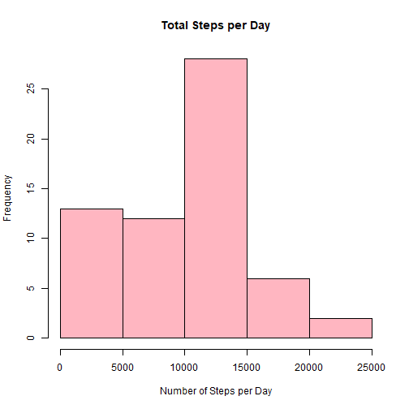
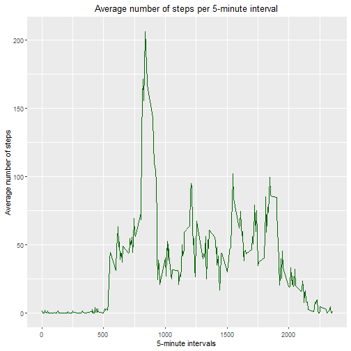
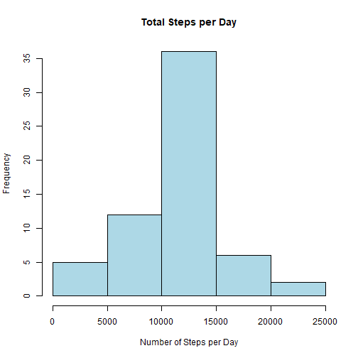
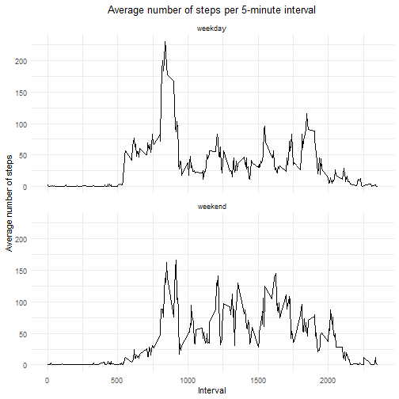

# **Reproducible Research Assignment 1**

## Reading and Pre-processing Data

First, we use the function `read.csv()` to load our data into our environment. Since there will be different types of data processing needed, we will include this step under each task as needed.


```r
activity <- read.csv("activity.csv")

head(activity)
```

We also need to load any packages that we will need for the tasks.


```r
library(tidyverse)
```

## What is the mean total number of steps taken per day?

It is advised to ignore the missing values in the dataset for this part of the assignment.

### 1. Make a histogram of the total number of steps taken each day.

**Step 1**: group the data by day and sum total steps per day.


```r
daily_steps <- activity %>% 
  group_by(date) %>% 
  summarise(total_steps = sum(steps, na.rm = TRUE))
```

**Step 2**: create the histogram.


```r
hist(daily_steps$total_steps,
     main = "Total Steps per Day",
     xlab = "Number of Steps per Day",
     col = "lightpink",
     border = "black")
```



**Step 3**: calculate mean and median.


```r
mean(daily_steps$total_steps, na.rm = TRUE)
```

```
## [1] 9354.23
```

```r
median(daily_steps$total_steps, na.rm = TRUE)
```

```
## [1] 10395
```

The mean number of steps was **9354** per day and the median was **10395**.

## What is the average daily activity pattern?

**Step 1**: group steps by each 5-minute interval and calculate average number of steps.


```r
steps_by_interval <- activity %>% 
  group_by(interval) %>% 
  summarise(average_steps = mean(steps, na.rm = TRUE))
```

**Step 2**: create a time series plot of the 5-minute interval (x-axis) and the average number of steps taken, averaged across all days (y-axis).


```r
ggplot(data = steps_by_interval, aes(x= interval, y=average_steps))+
  geom_line(color= "darkgreen")+
  labs(
    title = "Average number of steps per 5-minute interval",
    x = "5-minute intervals",
    y = "Average number of steps"
) +
  theme(plot.title = element_text(hjust = 0.5))
```



**Step 3**: calculate which 5-minute interval, on average across all the days in the dataset, contain the maximum number of steps.


```r
steps_by_interval[which.max(steps_by_interval$average_steps),] 
```

So, the interval that contains the maximum number of steps, as an average across all the days in the dataset, is interval **835** with an average of 206 steps.

## Inputting missing values

**Step 1**: calculate the total number of missing values in the dataset.


```r
sum(is.na(activity$steps))
```

```
## [1] 2304
```

**Step 2**: Filling in all missing values in the dataset using mean per 5-minutes interval across days.

The mean steps per 5-minute intervals across days have already been calculated in a previous task. Using the functions `mutate()` and `ifelse()`, the missing values can be substituted by mean steps for their specific 5-minute interval.


```r
activity_complete <- activity %>% 
  left_join(steps_by_interval, by = "interval") %>% 
  mutate(steps = ifelse(is.na(steps), average_steps, steps)) %>% 
  select(-average_steps)
```

**Step 3**: using the filled in data, create a histogram of the total number of steps taken each day and calculate and report the mean and median total number of steps taken per day.


```r
# calculate the total number of steps per day

daily_steps_complete <- activity_complete %>% 
  group_by(date) %>% 
  summarise(total_steps = sum(steps))

# create the histogram

hist(daily_steps_complete$total_steps,
     main = "Total Steps per Day",
     xlab = "Number of Steps per Day",
     col = "lightblue",
     border = "black")
```




```r
mean(daily_steps_complete$total_steps, na.rm = TRUE)
```

```
## [1] 10766.19
```

```r
median(daily_steps_complete$total_steps, na.rm = TRUE)
```

```
## [1] 10766.19
```

Comparatively with the original data before the missing values were inputted, both the mean and median are now higher and of the exact same value.

## Differences in activity patterns between weekdays and weekends

**Step 1**: classify dates into "weekday" and "weekend"


```r
activity_complete$days <- weekdays(as.Date(activity_complete$date))

activity_complete <- activity_complete %>%
  mutate(days_week = ifelse(days %in% c("Saturday", "Sunday"), "weekend", "weekday"))
```

**Step 2**: make a panel plot with a time series plot fo the 5-minute interval (x-axis) and the average number of steps taken, averaged across all weekday days or weekend days (y-axis).


```r
steps_by_interval_complete <- activity_complete %>% 
  group_by(interval, days_week) %>% 
  summarise(average_steps = mean(steps))
```

```
## `summarise()` has grouped output by 'interval'. You can override using the `.groups` argument.
```

```r
ggplot(steps_by_interval_complete, aes(x= interval, y = average_steps))+
  geom_line() +
  facet_wrap(~days_week, ncol=1)+
  labs(
    title = "Average number of steps per 5-minute interval",
    x = "Interval",
    y = "Average number of steps"
  ) +
  theme_minimal()+
  theme(plot.title = element_text(hjust = 0.5))
```


